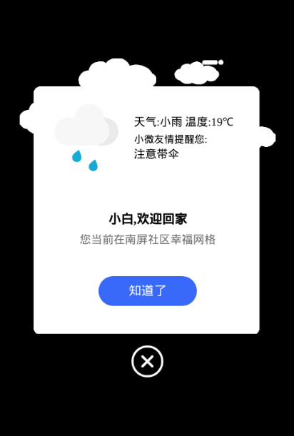

# floatWeather
floatWeather组件可以浮动显示天气情况

## 预览


## 使用
1. 在`json文件中引入`
```
{
  "usingComponents": {
    "floatWeather": "PATH/components/floatWeather/floatWeather"
  }
}
```
2. floatWeather 属性
```
<floatWeather location advice adviceTip welcome welcomeSentence welcomeLocation></floatWeather>
```
|属性|默认值|类型|必填|说明|
|--|--|--|--|--|
|location||String|true|获取天气当然要位置啦|
|advice|false|Boolean|false|是否显示温馨提示, 如预览中*小微友情提醒:注意带伞*|
|adviceTip||String|false|温馨提示标题, 如预览中*小薇友情提醒:*|
|welcome|false|Boolean|false|是否显示欢迎词, 如预览中*小白,欢迎回家 您当前在xxx*|
|welcomeSentence|false|String|false|欢迎词第一行|
|welcomeLocation|false|String|false|欢迎词第二行|
3. 关闭floastWeather组件
```
<floatWeather bind:closeWeather="closeWeather" wx:if="{{showFloatWeather}}"></floatWeather>
```
点击*知道了*或者*X*就会触发closeWeather事件, 通过页面设置状态即可关闭
```
Page({
  closeWeather(){
  this.setData({
    showFloatWeather: false
  })
  }
})

```

## 注意
这个组件用的是[心知天气](https://www.seniverse.com/)的API
你需要修改config.js来进行API的配置
